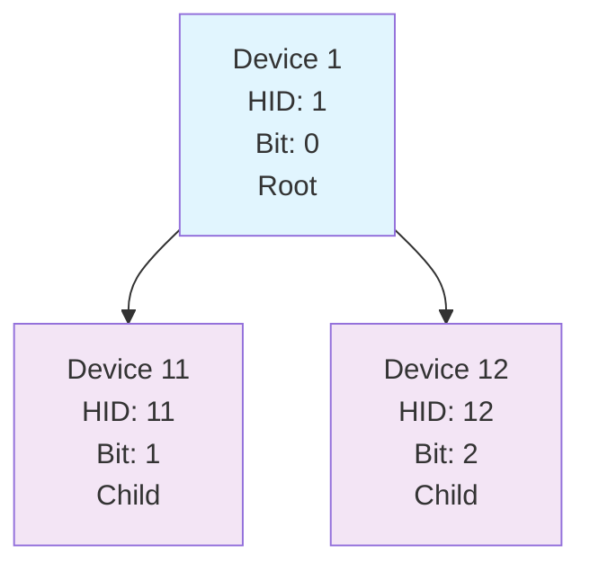
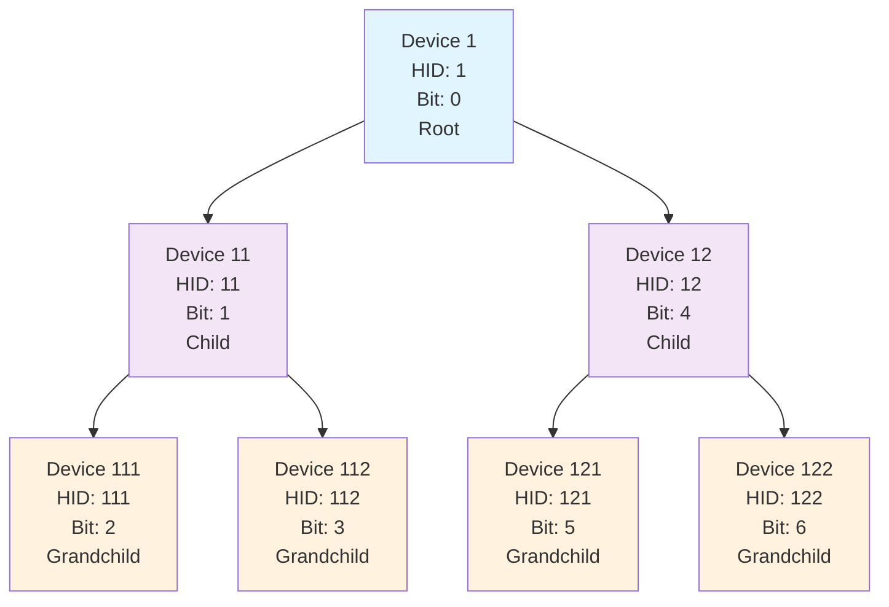
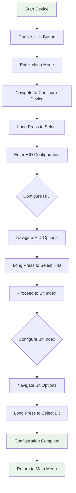
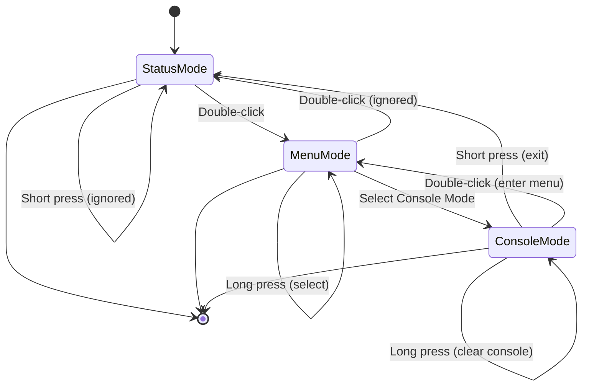
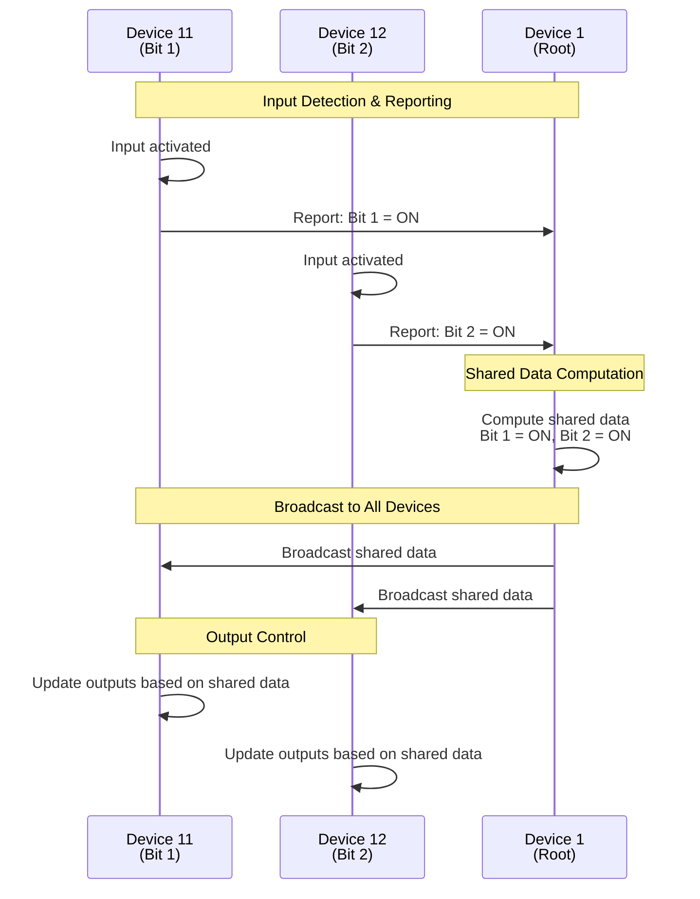

# ESP-NOW Tree Network Device Configuration Manual

## Overview

This manual explains how to configure your ESP-NOW Tree Network device with a **Hierarchical ID (HID)** and **Bit Index** for distributed I/O functionality.

## What are HID and Bit Index?

### Hierarchical ID (HID)
- **Purpose**: Identifies your device's position in the network tree structure
- **Format**: Multi-digit number (e.g., 11, 121, 1231)
- **Root Device**: HID = 1 (single digit)
- **Child Devices**: HID = Parent HID + additional digits (e.g., 11, 12, 13 are children of 1)
- **Example**: Device 121 is a child of device 12, which is a child of device 1

### Bit Index
- **Purpose**: Assigns your device to a specific bit position in the shared 32-bit data
- **Range**: 0-31 (32 available bit positions)
- **Function**: When your device's input is active, it sets its assigned bit in the shared data
- **Example**: Bit index 5 means your device controls bit 5 of the shared data

## Network Topology Visualization

### Simple Tree Structure (3 devices)


### Complex Tree Structure (7 devices)


## Configuration Flow Diagram



## Configuration Process

### Step 1: Enter Menu Mode
1. **Double-click** the button (GPIO_0) to enter menu mode
2. The display will show "Menu Mode" and the main menu

### Step 2: Access Device Configuration
1. Navigate to **"Configure Device"** using short presses
2. **Long press** to select this option
3. The system will enter HID configuration mode

### Step 3: Configure HID

#### HID Configuration Interface
- **Display shows**: "Set HID: X" (where X is current HID being built)
- **Navigation**: Short press to navigate through options
- **Selection**: Long press to select an option

#### HID Configuration Options
1. **"Set HID: X"** - Set the current HID value
2. **"Child: X1"** - Add digit 1 to current HID
3. **"Child: X2"** - Add digit 2 to current HID
4. **"Child: X3"** - Add digit 3 to current HID
5. **"Go Up"** - Remove last digit (if not at root)
6. **"Back"** - Exit without saving

#### Example: Setting HID = 121
1. Start with "Set HID: 1" (root)
2. Navigate to "Child: 12" and **long press**
3. Navigate to "Child: 121" and **long press**
4. Navigate to "Set HID: 121" and **long press** to confirm
5. System proceeds to bit index configuration

### Step 4: Configure Bit Index

#### Bit Index Configuration Interface
- **Display shows**: Bit indices in pages of 8 bits each
- **Navigation**: Short press to navigate through bits
- **Selection**: Long press to select a bit index
- **Page Navigation**: Use "Prev Page" and "Next Page" options

#### Bit Index Options
- **"< Prev Page"** - Go to previous page of 8 bits
- **"Next Page >"** - Go to next page of 8 bits
- **"Bit X"** - Select bit index X (0-31)
- **"Bit X *"** - Currently configured bit (marked with *)
- **"Back"** - Exit without saving

#### Example: Setting Bit Index = 5
1. Navigate to "Bit 5" (on first page)
2. **Long press** to select bit index 5
3. System confirms and returns to main menu

## Button Functions Diagram



## Configuration Examples

### Example 1: Root Device (HID = 1, Bit Index = 0)
```
HID Configuration:
- Start: "Set HID: 1"
- Select: "Set HID: 1" (long press)

Bit Index Configuration:
- Navigate to: "Bit 0"
- Select: "Bit 0" (long press)
```

### Example 2: Child Device (HID = 11, Bit Index = 5)
```
HID Configuration:
- Start: "Set HID: 1"
- Navigate to: "Child: 11"
- Select: "Child: 11" (long press)
- Navigate to: "Set HID: 11"
- Select: "Set HID: 11" (long press)

Bit Index Configuration:
- Navigate to: "Bit 5"
- Select: "Bit 5" (long press)
```

### Example 3: Grandchild Device (HID = 121, Bit Index = 12)
```
HID Configuration:
- Start: "Set HID: 1"
- Navigate to: "Child: 11"
- Select: "Child: 11" (long press)
- Navigate to: "Child: 121"
- Select: "Child: 121" (long press)
- Navigate to: "Set HID: 121"
- Select: "Set HID: 121" (long press)

Bit Index Configuration:
- Navigate to: "Next Page >" (to get to page with bits 8-15)
- Navigate to: "Bit 12"
- Select: "Bit 12" (long press)
```

## Network Topology Examples

### Simple Tree (3 devices)
```
Device 1 (Root)
├── Device 11 (Child)
└── Device 12 (Child)

Configuration:
- Device 1: HID=1, Bit=0
- Device 11: HID=11, Bit=1
- Device 12: HID=12, Bit=2
```

### Complex Tree (7 devices)
```
Device 1 (Root)
├── Device 11 (Child)
│   ├── Device 111 (Grandchild)
│   └── Device 112 (Grandchild)
└── Device 12 (Child)
    ├── Device 121 (Grandchild)
    └── Device 122 (Grandchild)

Configuration:
- Device 1: HID=1, Bit=0
- Device 11: HID=11, Bit=1
- Device 111: HID=111, Bit=2
- Device 112: HID=112, Bit=3
- Device 12: HID=12, Bit=4
- Device 121: HID=121, Bit=5
- Device 122: HID=122, Bit=6
```

## Distributed I/O Operation Diagram



## Button Functions Summary

### Menu Navigation
- **Short Press**: Navigate down through menu items (cursor moves to highlight selected item)
- **Long Press**: Select current menu item (execute the highlighted option)
- **Double-Click**: Enter menu mode (from status/console mode)
- **Note**: A cursor/highlight indicates the currently selected menu item on the OLED display

### HID Configuration
- **Short Press**: Navigate through HID options
- **Long Press**: Select HID option or add digit
- **"Go Up"**: Remove last digit from HID
- **"Back"**: Exit without saving

### Bit Index Configuration
- **Short Press**: Navigate through bit indices
- **Long Press**: Select bit index
- **"Prev/Next Page"**: Navigate between pages of 8 bits
- **"Back"**: Exit without saving

## Troubleshooting

### Common Issues

1. **"Device Not Configured"**
   - **Cause**: HID or bit index not set
   - **Solution**: Follow configuration process above

2. **"Invalid bit X"**
   - **Cause**: Bit index already assigned to another device
   - **Solution**: Choose a different bit index (0-31)

3. **Menu Navigation Not Working**
   - **Cause**: Device not in menu mode
   - **Solution**: Double-click to enter menu mode

4. **Configuration Not Saving**
   - **Cause**: Exited without confirming selection
   - **Solution**: Use "Set HID: X" and "Bit X" to confirm selections

### Verification

After configuration, check:
1. **Status Display**: Should show "HID:X B:Y" (e.g., "HID:11 B:5")
2. **Menu Status**: "Show Device Status" should display your configuration
3. **Network Communication**: Device should communicate with parent/children

## Advanced Features

### Distributed I/O Operation
- **Input Detection**: When your device's input is active, it sets its assigned bit
- **Shared Data**: All devices can see the combined 32-bit shared data
- **Output Control**: Root device can control outputs based on shared data

### Auto-Reporting
- **Enabled**: Device automatically reports input changes to parent
- **Disabled**: Manual reporting only
- **Configuration**: Available in Advanced menu

### Console Mode
- **Purpose**: View real-time network activity and messages
- **Access**: From main menu → "Console Mode"
- **Navigation**: Short press to exit, long press to clear, double-click to enter menu

## Configuration Best Practices

1. **Plan Your Network**: Design tree structure before configuring devices
2. **Unique Bit Indices**: Ensure each device has a unique bit index (0-31)
3. **Logical HID Assignment**: Use sequential numbers for easy identification
4. **Documentation**: Keep a record of each device's HID and bit index
5. **Testing**: Verify communication after configuration

## Quick Reference

### Button Actions
- **Menu Mode**: Short=Navigate, Long=Select, Double=Ignore
- **Console Mode**: Short=Exit, Long=Clear, Double=Menu
- **Status Mode**: Short=Ignore, Long=Status, Double=Menu

### Configuration Commands
- **Enter Menu**: Double-click button
- **Configure Device**: Menu → Configure Device
- **Set HID**: Navigate and long press "Set HID: X"
- **Set Bit Index**: Navigate and long press "Bit X"
- **Exit**: Use "Back" option or double-click to exit menu

### Status Indicators
- **HID Configured**: "HID:X" displayed
- **Bit Index Configured**: "B:Y" displayed
- **Root Device**: "(R)" suffix on HID
- **Not Configured**: "Device Not Configured" displayed 